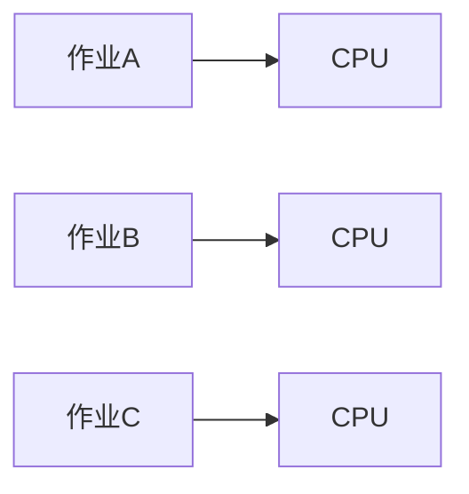

# 第1章 操作系统引论

> 操作系统是计算机系统的核心软件，相当于计算机的"大管家"。本章是操作系统学习的入门篇，帮助理解操作系统的整体框架。

## 1.1 操作系统是什么？
#第1章-操作系统引论/什么是操作系统

**操作系统(OS)** 是管理计算机硬件与软件资源的程序集合，是用户与计算机硬件之间的桥梁。

```
┌─────────────────────────────────────┐
│           用户应用程序              │  ← 你写的程序
├─────────────────────────────────────┤
│            操作系统                 │  ← Windows/Linux/macOS
├─────────────────────────────────────┤
│         计算机硬件(CPU/内存/硬盘)   │  ← 物理设备
└─────────────────────────────────────┘
```

### 操作系统做什么？（核心功能）

| 功能 | 说明 | 比喻 |
|------|------|------|
| **CPU管理** | 分配CPU时间给各个程序 | 公司的调度员安排谁先做事 |
| **内存管理** | 分配和回收内存空间 | 公司的后勤分配办公室 |
| **文件管理** | 管理磁盘上的文件 | 公司的档案管理员 |
| **设备管理** | 管理打印机、鼠标等外设 | 公司的采购和设备维护 |

### 操作系统的目标
- **资源管理**：合理分配CPU、内存、磁盘等资源（**最重要**）
- **提供接口**：让用户方便使用计算机（命令行/GUI）
- **提高性能**：让计算机运行得更快
- **确保安全**：保护用户数据不被破坏

---

## 1.2 操作系统发展史
#第1章-操作系统引论/发展历程

```
时间线：
1950s ──▶ 1960s ──▶ 1970s ──▶ 1980s ──▶ 现在
  │        │        │        │
  ▼        ▼        ▼        ▼
 手工    单道批   多道批   分时系统 → 现代OS
```

### 1.2.1 手工操作（无OS时代）
- 程序员直接操作硬件
- 用穿孔卡片输入程序
- **缺点**：效率极低，CPU经常空闲等待

### 1.2.2 单道批处理系统
- 把多个作业成批输入，一次一个自动处理
- **优点**：减少人工干预
- **缺点**：CPU和I/O设备串行工作，利用率低



### 1.2.3 多道批处理系统（重要！）
- 同时在内存中放多个程序，**交替执行**
- **核心突破**：提高了CPU和设备利用率

```mermaid
gantt
    title 多道程序交替执行
    dateFormat HH:mm
    axisFormat %H:%M
    section 作业A
    I/O操作   :a1, 00:00, 2m
    section 作业B
    CPU计算   :a2, 00:02, 2m
```



**优点**：资源利用率高、系统吞吐量大
**缺点**：无交互能力、周转时间长

### 1.2.4 分时系统（重要！）
- 把CPU时间切成**时间片**，轮流给各个用户
- **特点**：每个用户都感觉自己在独占CPU

```mermaid
gantt
    title 时间片轮转
    dateFormat HH:mm
    axisFormat %H:%M
    section 用户A
    CPU :a1, 00:00, 2m
    section 用户B
    CPU :a2, 00:02, 2m
    section 用户C
    CPU :a3, 00:04, 2m
```



**优点**：交互性好、响应快、支持多用户

### 1.2.5 实时系统
- 必须在**截止时间**内完成任务
- **应用**：工业控制、自动驾驶、飞机飞行系统
- **特点**：实时性、可靠性高

### 1.2.6 现代操作系统类型

| 类型 | 代表 | 特点 |
|------|------|------|
| **桌面系统** | Windows、macOS、Linux | 图形界面、交互性强 |
| **嵌入式系统** | Android、iOS、RTOS | 体积小、专用性强 |
| **服务器系统** | Windows Server、Linux | 高性能、网络功能强 |
| **分布式系统** | Hadoop、Kubernetes | 多计算机协同工作 |

---

## 1.3 操作系统四大特征
#第1章-操作系统引论/基本特性

### 1.3.1 并发 vs 并行

```
并发（Concurrent）：
  程序A: |██▌▐|       
  程序B:     |██▌▐|   → 微观交替，宏观同时
  
并行（Parallel）：
  CPU1: |████|        
  CPU2: |████|        → 真正同时执行
```

- **并发**：同一时间段内，多个程序"同时"执行（交替进行）
- **并行**：同一时刻，多个程序真正同时执行（需要多CPU）

> 📌 **考研易错点**：单核CPU只能并发，不能并行！

### 1.3.2 共享
- 系统资源被多个并发程序共同使用
- **互斥共享**：如打印机，同一时间只能一个程序用
- **同时访问**：如磁盘，多个程序可同时读取

### 1.3.3 虚拟
把物理资源**抽象**成逻辑上更强大的东西：
- **虚拟CPU**：让每个程序感觉自己在独占CPU
- **虚拟内存**：让程序使用比实际内存更大的空间
- **虚拟设备**：把物理设备抽象为多个逻辑设备

### 1.3.4 异步
- 程序执行"走走停停"，不是一直连续执行
- 因为CPU要在多个程序间切换

---

## 1.4 操作系统运行机制
#第1章-操作系统引论/运行机制

### 1.4.1 CPU的两种工作状态

```
┌────────────────────────────────────────┐
│  内核态（Kernel Mode / 管态）           │  ← 操作系统运行
│  - 可以访问所有硬件                     │
│  - 可以执行任何指令                     │
├────────────────────────────────────────┤
│  用户态（User Mode / 用户态）           │  ← 应用程序运行
│  - 只能访问受限的内存区域              │
│  - 只能执行普通指令                     │
└────────────────────────────────────────┘
```

**为什么需要两种状态？**
- 防止用户程序破坏系统核心
- 用户需要"请求"操作系统帮忙做危险操作

### 1.4.2 中断与异常 ⭐

| 类型 | 来源 | 同步/异步 | 例子 |
|------|------|-----------|------|
| **中断（外中断）** | CPU外部设备 | 异步 | 键盘按键、I/O完成、时钟中断 |
| **异常（内中断）** | CPU内部 | 同步 | 缺页、除零、系统调用（trap） |

> [!tip] 记忆
> 内中断是CPU自己惹的事，外中断是别人来打扰

**中断处理流程**：
1. 保护现场（PSW、PC入栈）
2. 分析中断源
3. 执行中断处理程序
4. 恢复现场

### 1.4.3 系统调用（重要！）

**系统调用**是用户程序**请求操作系统服务**的接口。

```
用户程序 ──系统调用──▶ 操作系统 ──▶ 硬件
   ↑                       │
   └───────返回结果────────┘
```

**常见系统调用类型**：
- 进程控制：`fork()`创建进程、`exit()`终止进程
- 文件操作：`open()`、`read()`、`write()`、`close()`
- 设备操作：`read()`、`write()`
- 通信：`pipe()`管道、`socket()`套接字

> 📌 **考研考点**：系统调用是用户态到内核态的**唯一入口**

---

## 1.5 操作系统结构
#第1章-操作系统引论/系统结构

| 结构类型 | 特点 | 代表系统 |
|----------|------|----------|
| **简单结构** | 所有功能在一个模块 | MS-DOS |
| **模块化** | 按功能分成模块 | 早期UNIX |
| **分层式** | 每层只依赖下层 | THE系统 |
| **微内核** | 内核小，其他放用户态 | Windows NT、Mach |
| **混合结构** | 多种结构组合 | Linux、Windows |

> [!tip] 大内核 vs 微内核
> - **大内核（宏内核）**：所有功能在内核态，效率高但耦合大（Linux、Unix）
> - **微内核**：内核仅保留最基本功能，其他在用户态，稳定性好但性能略低（Minix）

---

## 1.7 本章知识关联图
#第1章-操作系统引论/知识关联

- 进程管理 → [[03-操作系统/第2章-进程的描述与控制|第2章 详细讲解]]
- CPU调度 → [[03-操作系统/第3章-处理机调度|第3章 详细讲解]]
- 内存管理 → [[03-操作系统/第5章-存储器管理|第5章 详细讲解]]
- 虚拟内存 → [[03-操作系统/第6章-虚拟存储器|第6章 详细讲解]]

---

## 习题1（考研真题精选）

### 选择题

1. **【2011统考真题】** 下列关于操作系统任务的叙述中，正确的是？
   A. 操作系统是用户和计算机硬件之间的接口  
   B. 操作系统是计算机硬件和软件之间的接口  
   C. 操作系统是用户和计算机软件之间的接口  
   D. 操作系统是计算机各种硬件之间的接口  
   > **答案**：A  
   > **解析**：操作系统是用户与计算机硬件之间的接口。

2. **【2013统考真题】** 下列选项中，不属于多道程序设计的基本特征的是？
   A. 制约性  B. 顺序性  C. 共享性  D. 并发性  
   > **答案**：B  
   > **解析**：多道程序设计的特征：共享、并发、异步。顺序性是单道程序的特点。

3. **【2015统考真题】** 相对于传统操作系统结构，微内核结构的主要优点是？
   A. 更高的效率  B. 更高的安全性  C. 更易于扩展  D. 更易于集成新硬件  
   > **答案**：B  
   > **解析**：微内核结构将核心功能最小化，提高系统安全性和可靠性。

4. **【2018统考真题】** 下列关于系统调用的叙述中，正确的是？
   A. 系统调用是用户程序直接调用操作系统内核的接口  
   B. 系统调用是操作系统内核为用户程序提供的接口  
   C. 系统调用只能由特权指令实现  
   D. 系统调用是操作系统内核运行的入口  
   > **答案**：B  
   > **解析**：系统调用是操作系统内核为应用程序提供的接口。

### 综合应用题

5. **【2012统考真题】** 什么是多道程序设计技术？它有什么特点？

**参考答案**：
多道程序设计技术是指在同一时间内把多个程序装入内存，并允许它们交替在CPU上运行。

**特点**：
- 多道：内存中同时存在多个程序
- 宏观并行：多个程序同时执行
- 微观串行：CPU交替执行各个程序
- 提高了资源利用率和系统吞吐量

6. **【2017统考真题】** 说明操作系统内核态与用户态的区别，并举例说明何时需要从用户态切换到内核态。

**参考答案**：
- **内核态**：操作系统运行状态，可执行特权指令，访问所有内存
- **用户态**：应用程序运行状态，只能执行普通指令，访问受限内存

**切换时机**：
- 发生中断或异常时
- 应用程序执行系统调用时
- 需要操作系统提供服务时（如文件操作、进程管理）

---

> **本章小结**
> 1. 操作系统是用户与硬件的接口，管理CPU、内存、文件、设备
> 2. 发展历程：单道→多道→分时→实时
> 3. 四大特征：并发、共享、虚拟、异步
> 4. CPU两种状态：内核态（管态）和用户态（用户态）
> 5. 系统调用是用户态进入内核态的唯一入口

---

[[操作系统目录.md|← 返回目录]] | [[第2章-进程的描述与控制.md|下一章 →]]
