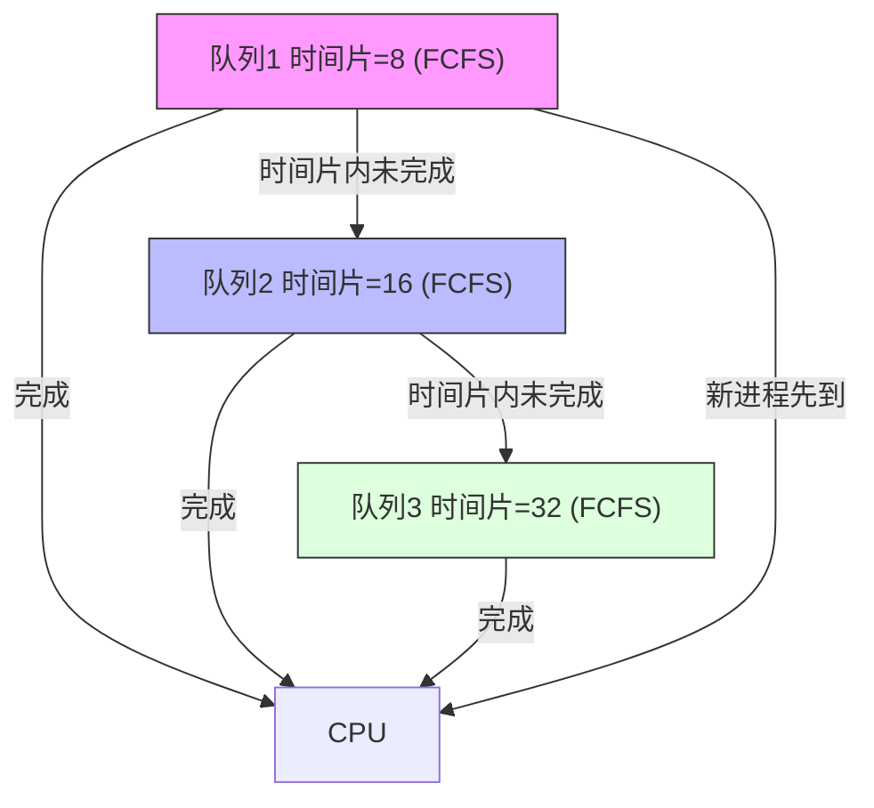

# 第3章 处理机调度

> 处理机调度就是决定"让谁先用CPU"的问题。本章讲解各种调度算法，是操作系统的核心考点！

## 3.1 调度的基本概念
#第3章-处理机调度/调度层次

### 什么是处理机调度？

处理机调度就是决定"让谁先用CPU"的问题。

### 调度的三个层次

| 层级 | 名称 | 说明 | 频率 |
|------|------|------|------|
| **高级调度** | 作业调度 | 从外存后备队列选作业调入内存 | 几分钟~几十分钟一次 |
| **中级调度** | 内存调度 | 把进程挂起或激活，平衡内存 | 几秒~几分钟一次 |
| **低级调度** | 进程调度 | 从内存就绪队列选进程分配CPU | 几毫秒一次（最频繁） |

> [!tip] 记忆
> 高级 = 谁进内存，中级 = 谁休息，低级 = 谁用CPU

### 调度算法的评价指标 ⭐

| 指标 | 公式 | 说明 |
|------|------|------|
| **周转时间** | 完成时间 − 到达时间 | 越短越好 |
| **平均周转时间** | Σ周转时间 / n | 系统整体效率 |
| **带权周转时间** | 周转时间 / 实际运行时间 | ≥ 1，越接近1越好 |
| **等待时间** | 进程在就绪队列等待总和 | 不包含执行和I/O |
| **响应时间** | 提交到首次响应的时间 | 分时系统关注 |
| **CPU利用率** | CPU有效工作时间 / 总时间 | 越高越好 |
| **吞吐量** | 单位时间完成进程数 | 越高越好 |

> 周转时间 = 完成时间 − 到达时间
> 带权周转时间 = 周转时间 ÷ 服务时间（实际运行时间）

### 调度算法的目标

| 系统类型 | 侧重点 |
|----------|---------|
| 批处理系统 | 提高吞吐量、缩短周转时间、提高CPU利用率 |
| 分时系统 | 响应时间快、公平性 |
| 实时系统 | 截止时间保证、可预测性 |

---

## 3.2 调度算法（重点！）
#第3章-处理机调度/调度算法

### 3.2.1 先来先服务（FCFS）

| 特点 | 说明 |
|------|------|
| 实现 | 就绪队列FIFO |
| 调度方式 | 非抢占 |
| 优点 | 公平、简单 |
| 缺点 | **对短作业不利**（convoy效应），平均等待时间长 |

### 3.2.2 短作业优先（SJF/SPF）

| 特点 | 说明 |
|------|------|
| 实现 | 选择最短运行时间的进程 |
| 调度方式 | 可抢占(SRTN) / 非抢占(SJF) |
| 优点 | **平均等待时间最小**（理论上最优） |
| 缺点 | 对长作业不利，可能导致饥饿；需预知运行时间 |

#### 非抢占式 SJF
当前进程运行完，再选最短的。

#### 抢占式 SRTN（Shortest Remaining Time Next）
每次新进程到达，比较剩余时间，更短则抢占。

```
📌 示例（非抢占SJF）：
进程A：运行时间6，到达时间0
进程B：运行时间3，到达时间2
进程C：运行时间4，到达时间4

调度：
时刻0：A到达 → 选A
时刻6：A结束，此时B,C都到了 → 选B（时间短）
时刻9：B结束 → 选C
周转时间：A=6, B=9-2=7, C=9-4=5
平均周转时间 = (6+7+5)/3 = 6
```

### 3.2.3 优先级调度

| 类型 | 说明 |
|------|------|
| 静态优先级 | 创建时确定，运行中不变 |
| 动态优先级 | 运行时可以调整（防饥饿） |

- **非抢占式**：当前进程运行完才选更高优先级的
- **抢占式**：更高优先级进程到达时立即抢占CPU

### 3.2.4 时间片轮转（RR）

| 特点 | 说明 |
|------|------|
| 实现 | FCFS + 固定时间片 |
| 调度方式 | 抢占 |
| 优点 | 响应快，**适合分时系统** |
| 缺点 | 时间片大小很关键 |

> [!warning] 时间片选择
> - **太大** → 退化为FCFS
> - **太小** → 上下文切换开销过大
> - 一般取 **20~50ms**

### 3.2.5 多级队列调度

就绪队列分成多个独立队列，不同队列可用不同调度算法：

| 队列 | 用途 | 调度算法 |
|------|------|----------|
| 系统进程队列 | 最高优先级 | 优先级调度 |
| 交互进程队列 | 中等优先级 | RR |
| 批处理进程队列 | 最低优先级 | FCFS |

队列间有固定优先级，高优先级队列为空才调度下级。

### 3.2.6 多级反馈队列 ⭐

**规则**：
1. 设置多个队列，优先级从高到低
2. 每个队列时间片不同（优先级越高时间片越小）
3. 新进程先进入最高优先级队列
4. 时间片内没执行完 → 降级到下一队列
5. 只有上级队列为空，才调度下级队列
6. 各级队列内部用FCFS

多级反馈队列结构：



> [!tip] 多级反馈队列的特点
> - **I/O密集型**（短CPU爆发）→ 很快在高优先级队列完成
> - **计算密集型**（长CPU爆发）→ 逐渐降级到低优先级队列
> - 既照顾短作业，又不让长作业饿死，是**综合效果最好的调度算法**

---

## 3.3 调度算法对比
#第3章-处理机调度/算法对比

| 算法 | 抢占/非抢占 | 是否可能饥饿 | 适用场景 |
|------|-------------|-------------|----------|
| **FCFS** | 非抢占 | ❌ | 批处理 |
| **SJF** | 均可 | ✅ 长作业可能饿 | 批处理 |
| **SRTN** | 抢占 | ✅ 长作业可能饿 | 批处理 |
| **RR** | 抢占 | ❌ | **分时系统** |
| **优先级** | 均可 | ✅ 低优先级可能饿 | 实时系统 |
| **多级反馈队列** | 抢占 | ❌ | **通用OS** |

> [!tip] 选择题常考陷阱
> - "FCFS对短作业有利" → 恰恰**最不利**
> - "SJF一定是抢占式" → 有抢占(SRTN)和非抢占两种
> - "多级反馈队列各队列时间片相同" → 不同队列时间片不同

---

## 3.4 实时调度（了解）
#第3章-处理机调度/实时调度

### 实时系统特点

实时系统必须在"截止时间"前完成：

| 类型 | 要求 | 例子 |
|------|------|------|
| **硬实时** | 必须完成 | 飞机自动驾驶、工业控制 |
| **软实时** | 尽量完成 | 视频播放、在线游戏 |

### 实时调度算法

| 算法 | 原理 |
|------|------|
| **EDF**
（Earliest Deadline First） | 谁截止时间最早谁先执行 |
| **LLF**
（Least Laxity First） | 谁最"着急"谁先执行 |

---

## 3.5 本章知识关联
#第3章-处理机调度/知识关联

- [[03-操作系统/第2章-进程的描述与控制|进程状态]]：调度影响进程状态
- [[03-操作系统/第4章-进程同步与死锁|进程同步]]：调度与同步的关系

---

## 习题3（考研真题精选）

### 选择题

1. **【2011统考真题】** 在操作系统中，"调度"指什么？
   A. 从磁盘选择进程调入内存  
   B. 从内存选择进程使用CPU  
   C. 从外存选择作业调入内存  
   D. 从CPU选择进程使用内存  
   > **答案**：B  
   > **解析**：进程调度是从就绪队列选进程分配CPU。

2. **【2013统考真题】** 下列选项中，满足短作业优先且不会发生饥饿的是？
   A. FCFS  B. SJF  C. RR  D. 多级反馈队列  
   > **答案**：D  
   > **解析**：多级反馈队列综合了SJF的优点，同时避免长作业饿死。

3. **【2015统考真题】** 某系统采用基于优先级的调度，优先级相同则用时间片轮转，该系统属于什么系统？
   A. 批处理  B. 实时  C. 分时  D. 都不是  
   > **答案**：C  
   > **解析**：时间片轮转是分时系统的特征。

4. **【2017统考真题】** 下列关于FCFS和SJF的说法，正确的是？
   A. FCFS平均周转时间短  
   B. SJF对长作业友好  
   C. FCFS对短作业不友好  
   D. SJF需要知道作业运行时间  
   > **答案**：C、D  
   > **解析**：SJF平均周转时间最短，需要预知运行时间。

5. **【2019统考真题】** 时间片轮转调度中，时间片大小为2，第1个进程运行完需要几个时间片？
   A. 1  B. 2  C. 3  D. 4  
   > **答案**：C  
   > **解析**：运行时间4，时间片2，需要2个时间片。

### 计算题

6. **【2012统考真题】** 假设3个进程到达时间分别为0、1、3，运行时间分别为8、4、5。用SJF和FCFS分别计算平均周转时间。

**参考答案**：
```
FCFS：运行顺序A→B→C
- A: 周转时间 = 8-0 = 8
- B: 周转时间 = 12-1 = 11  
- C: 周转时间 = 17-3 = 14
平均周转时间 = (8+11+14)/3 = 11

SJF：
- 0时刻A到，运行A(8)
- 1时刻B到，但A在运行
- 3时刻C到
- 8时刻A结束，选B(C=3<4)，运行B(4)
- 12时刻B结束，运行C(5)
- 17时刻C结束
- A: 8-0 = 8
- B: 12-1 = 11
- C: 17-3 = 14
平均周转时间 = 11（相同）
```

7. **【2016统考真题】** 简述多级反馈队列调度算法的工作原理。

**参考答案**：
```
1. 设置多个就绪队列，优先级从高到低
2. 每个队列时间片大小不同（递增）
3. 新进程先进入第1级队列
4. 如果时间片用完未完成，降入下一级
5. 高级队列为空时才调度低级队列
6. 优点：综合了FCFS、SJF、RR的优点
```

---

> **本章小结**
> 1. 调度层次：高级→中级→低级
> 2. FCFS：简单公平，对短作业不友好
> 3. SJF：平均周转时间最短，可能长作业饿死
> 4. 时间片轮转：分时系统标准，公平响应快
> 5. 多级反馈队列：综合最优的调度算法

---

[[第2章-进程的描述与控制.md|← 上一章]] | [[操作系统目录.md|返回目录]] | [[第4章-进程同步与死锁.md|下一章 →]]
