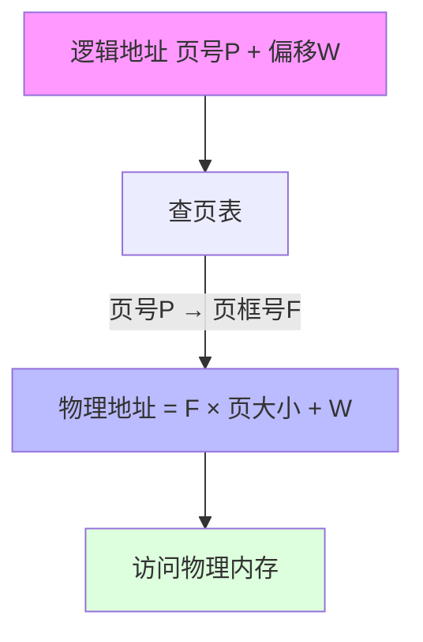
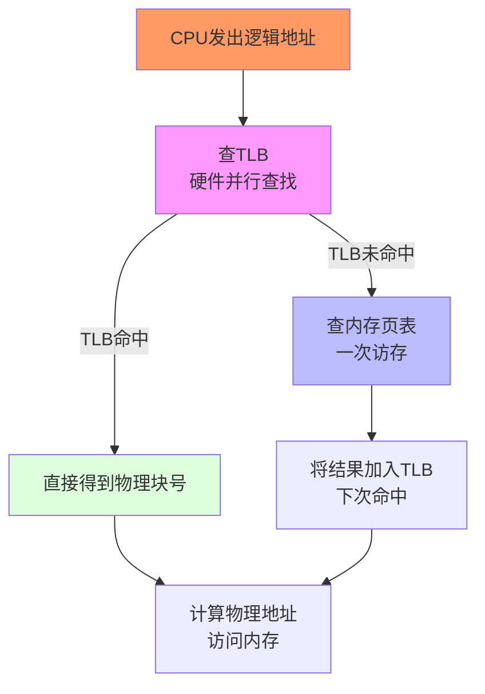

# 第5章 存储器管理

## 5.1 存储器的层次结构

### 多层结构的存储器

存储器层次结构：从快到慢、从贵到便宜。

| 层次 | 速度 | 容量 | 管理方式 |
|------|------|------|----------|
| **寄存器** | 最快 | 最小（字节级） | CPU直接管理 |
| **高速缓存（Cache）** | 快 | 小（MB级） | 硬件自动管理 |
| **主存储器（RAM）** | 中等 | 中等（GB级） | OS管理 |
| **外存储器（磁盘/SSD）** | 慢 | 大（TB级） | OS文件系统管理 |

> [!tip] 局部性原理
> Cache能工作是因为程序具有**时间局部性**（刚访问的地址很可能再次访问）和**空间局部性**（刚访问的地址附近很可能被访问）。

### 内存管理的四大功能 ⭐

| 功能 | 说明 |
|------|------|
| **内存分配与回收** | 进程创建时分配，结束时回收 |
| **地址转换** | 逻辑地址 → 物理地址 |
| **内存保护** | 各进程只访问自己的内存空间 |
| **内存扩充** | 虚拟内存技术，感觉内存比实际大 |

## 5.2 程序的装入与链接

### 地址与重定位

| 概念 | 说明 |
|------|------|
| **逻辑地址** | 程序中使用的地址（相对地址） |
| **物理地址** | 内存中的实际地址（绝对地址） |
| **重定位** | 将逻辑地址转换为物理地址的过程 |

### 三种装入方式

| 方式 | 转换时机 | 特点 |
|------|----------|------|
| **绝对装入** | 编译时确定 | 只适用于单道程序 |
| **可重定位装入** | 装入时一次性转换 | 装入后不能移动（静态重定位） |
| **动态运行时装入** | 运行时逐条转换 | 可移动（需要**重定位寄存器**）⭐ |

### 三种链接方式

| 方式 | 时机 | 特点 |
|------|------|------|
| **静态链接** | 编译时 | 链接后不可改变，占用空间大 |
| **装入时动态链接** | 装入时 | 装入时链接目标模块 |
| **运行时动态链接** | 运行时 | 用到哪个模块才链接（节省内存）⭐ |

## 5.3 交换技术

**交换（Swapping）**：将进程在内存和外存之间换入换出，提高内存利用率。

**换出策略**：优先选择阻塞状态、优先级低、驻留时间长的进程。

## 5.4 连续分配存储管理方式 ⭐

### 分配方式对比

| 方式 | 原理 | 优点 | 缺点 |
|------|------|------|------|
| **单一连续分配** | 内存分为系统区+用户区 | 简单 | 只适合单道程序 |
| **固定分区分配** | 预分成固定大小分区 | 实现简单 | **内部碎片** |
| **动态分区分配** | 按需动态划分 | 无内部碎片 | **外部碎片** |

### 动态分区分配算法 ⭐

| 算法 | 策略 | 特点 |
|------|------|------|
| **首次适应（FF）** | 从低地址找第一个够大的 | **最快** |
| **最佳适应（BF）** | 找刚好够用的最小空闲区 | 容易产生**小碎片** |
| **最坏适应（WF）** | 找最大的空闲区 | 减少小碎片，但大分区变少 |
| **循环首次适应（NF）** | 从上一次位置往后找 | 分配更均匀 |

### 碎片问题

| 类型 | 原因 | 解决方法 |
|------|------|----------|
| **外部碎片** | 空闲空间不连续，总和够但无法分配 | **紧凑（Compaction）**：移动进程合并碎片 |
| **内部碎片** | 分配的空间比需要的大，浪费在分区内 | 改用分页管理（页大小固定，损失最多一页） |

> [!tip] 记忆
> - 首次适应（FF）— 快
> - 最佳适应（BF）— 精打细算
> - 最坏适应（WF）— 先拣大的

## 5.5 分页存储管理方式 ⭐⭐⭐

### 基本概念

| 概念 | 说明 |
|------|------|
| **页（Page）** | 进程逻辑地址空间的分块（4KB常见） |
| **页框/物理块（Page Frame）** | 物理内存的分块，与页面大小相同 |
| **页表** | 页号 → 页框号的映射表 |
| **页表项** | 页号 + 页框号 + 标志位 |

> 分页解决外部碎片：进程不要求连续内存，页面可分散到不同页框。
> 但仍有**内部碎片**（最后一页没用满）。

### 地址结构

```
32位逻辑地址示例（页大小4KB=2^12）：
┌──────────────┬──────────────┐
│  页号 (20位)  │  偏移 (12位)  │
└──────────────┴──────────────┘
```

### 地址变换 ⭐




📌 **例题**：页面大小4KB，页表：0→2, 1→3, 2→5。逻辑地址4097？

```
页号 = 4097 / 4096 = 1，偏移 = 4097 % 4096 = 1
页号1 → 块号3
物理地址 = 3 × 4096 + 1 = 12289
```

### 引入快表（TLB）⭐

**TLB（Translation Lookaside Buffer）**：页表的Cache，存放最近使用的页表项。

**地址转换流程**：



**有效访问时间（EAT）**：
| 参数 | 说明 |
|------|------|
| t | 访问TLB的时间 |
| m | 访问一次内存的时间 |
| α | TLB命中率 |

**公式**：EAT = α × (t + m) + (1 − α) × (t + 2m)

### 两级页表与多级页表

**问题**：32位系统，页大小4KB → 页表有2^20项（约4MB），每个进程都要一个这么大的页表！

**解决**：把页表再分页，建立页目录。

| 级别 | 适用范围 |
|------|----------|
| **两级页表** | 32位系统 |
| **多级页表** | 64位系统（级数随地址宽度增加） |

### 反置页表

以**页框号**为索引（常规页表以页号为索引），每个页框对应一个表项。

**优点**：页表大小与内存大小成正比，与进程数无关。

## 5.6 分段存储管理方式 ⭐

### 基本概念

**分段**：按程序逻辑分段（代码段、数据段、堆栈段等），每段有独立的虚拟地址空间。

| 段号 | 段基址 | 段长 | 保护信息 |
|------|--------|------|---------|
| 0 | 1000 | 500 | R-X |
| 1 | 2000 | 300 | RW- |

### 地址变换

```
逻辑地址 = (段号, 段内偏移)
  → 查段表：段号 → 段基址 + 段长
  → 检查偏移 ≤ 段长（越界检查！）
  → 物理地址 = 段基址 + 段内偏移
```

### 分页 vs 分段 ⭐

| 对比项 | 分页 | 分段 |
|--------|------|------|
| **目的** | 解决碎片，提高利用率 | 满足编程逻辑需求 |
| **大小** | 固定（系统决定） | 可变（程序决定） |
| **用户可见** | 不可见（透明） | 可见 |
| **地址空间** | 一维 | 二维（段号+段内偏移） |
| **共享保护** | 难 | 易（按段保护） |
| **碎片** | 无外部碎片，有内部碎片 | 有外部碎片 |

## 5.7 段页式存储管理方式 ⭐

**原理**：先分段（逻辑清晰），每段再分页（消除外部碎片）。

**地址变换**（需要三次访存）：
```
逻辑地址 = (段号, 页号, 页内偏移)
段号 → 查段表 → 得页表起始地址
页号 → 查页表 → 得页框号
物理地址 = 页框号 × 页面大小 + 页内偏移
```

> [!tip] 段页式特点
> - 兼顾分段（逻辑清晰、便于共享保护）和分页（无外部碎片）
> - **缺点**：地址转换需要三次访存（段表→页表→数据），需要TLB加速

## 5.8 本章小结
- 内存管理四大功能：分配回收、地址转换、保护、扩充
- 连续分配：单一/固定/动态（FF/BF/WF/NF），碎片问题
- 分页（固定大小，消除外部碎片）+ TLB加速
- 分段（按逻辑划分，好共享保护）vs 分页
- 段页式：先分段再分页，兼顾两者优点

## 习题5（含考研真题）

---

[[第4章-进程同步与死锁.md|← 上一章]] | [[操作系统目录.md|返回目录]] | [[第6章-虚拟存储器.md|下一章 →]]