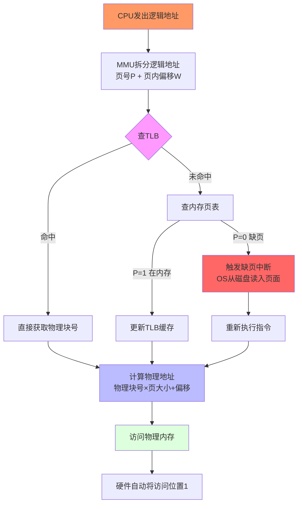

# 第6章 虚拟存储器

## 6.1 虚拟存储器概述
### 6.1.1 常规存储器管理方式的特征和局限性
**常规存储器管理方式**的特征：
- 一次性：程序必须全部装入内存才能运行
- 驻留性：程序一旦装入内存，就会一直驻留到运行结束

**局限性**：
- 内存容量限制：程序大小不能超过内存容量
- 内存利用率低：程序的某些部分可能很少使用
- 多道程序度受限：内存容量限制了并发运行的程序数量

### 6.1.2 虚拟存储器的定义与特征
**虚拟存储器**是指操作系统为每个进程提供的一个虚拟的地址空间，这个地址空间的大小可以远大于实际的内存容量。

**特征**：
- **多次性**：程序可以分多次装入内存
- **对换性**：程序可以在内存和外存之间对换
- **虚拟性**：提供比实际内存更大的地址空间

**虚拟存储器的容量**：由计算机的地址位数决定，如32位系统的虚拟地址空间为4GB。

### 6.1.3 虚拟存储器的实现方法

虚拟存储器不能凭空实现，必须建立在某种**非虚拟的存储管理方式**之上，再增加两个关键能力：**请求调页/调段**（用到才加载）和**置换功能**（内存满了换出）。由此产生三种实现方法：

#### 1. 请求分页存储管理 ⭐（408考试重点）
**基础**：分页存储管理（将程序划分为固定大小的页）

**新增功能**：
- **请求调页**：程序运行时，只将当前需要的页面调入内存，其余页面暂存在磁盘
- **页面置换**：当内存中的页框全部被占满，又需要调入新页面时，选择某些页面换出到磁盘

**理解关键**：页表新增了**状态位 P** 来标记页面是否在内存中。访问时若 P=0（页面不在内存），CPU 触发**缺页中断**，OS 负责从磁盘读入页面。

**"请求"的含义**：请求分页 = **demand paging** = 按需分页。不是"有一个请求过程"，而是一种**管理思想**——用到哪页才请求加载哪页，不是提前把所有页装入内存。

| 方式 | 做法 | 类比 |
|------|------|------|
| 基本分页 | 所有页一次性装入内存再运行 | 整桌菜全做好再开吃 |
| 请求分页 | 用到哪页才调入，缺页时去磁盘取 | 吃到哪道菜现点现做 |

**优点**：页大小固定，管理简单，磁盘交换效率高 → 实际操作系统（Linux、Windows）都用此方式

#### 2. 请求分段存储管理
**基础**：分段存储管理（将程序按逻辑划分为可变大小的段）

**新增功能**：
- **请求调段**：运行时只加载当前需要的段
- **段置换**：内存不足时，将某些段换出到磁盘

**特点**：
- 段的长度**不固定**，置换时分配/回收内存比请求分页复杂
- 但段是逻辑单位（代码段、数据段、堆栈段），**便于共享和保护**

#### 3. 请求段页式存储管理
**基础**：段页式存储管理（先分段，每段再分页）

**新增功能**：结合两者的优势 — 以段为单位实现共享和保护，以页为单位实现内存分配和置换

**工作流程**：
1. 按段访问（逻辑清晰、便于共享）
2. 段内再分页（固定大小、便于管理）
3. 置换以页为单位进行（解决分段管理中段长度不固定的复杂性）

| 实现方式 | 管理单位 | 置换单位 | 共享保护 | 实现复杂度 | 实际应用 |
|---------|---------|---------|---------|----------|---------|
| 请求分页 | 页（固定） | 页 | 困难 | 低 | Linux/Windows |
| 请求分段 | 段（可变） | 段 | 容易 | 高 | 早期系统 |
| 请求段页式 | 先段后页 | 页 | 容易 | 最高 | 部分大型系统 |

**408考点提示**：考研主要考察**请求分页存储管理**（6.2节详解），需要重点掌握其页表机制、缺页中断处理和地址变换过程。

## 6.2 请求分页存储管理方式
### 6.2.1 请求分页中的硬件支持
**请求分页**是虚拟存储器的一种实现方式，需要以下硬件支持：

#### 页与页框（基础概念）

在进入细节之前，先分清两个核心概念：

| 概念 | 存在哪 | 本质 | 大小 |
|------|--------|------|------|
| **页（Page）** | 虚拟地址空间（想象的） | 虚拟的，程序看到的 | 4KB（由 CPU 架构决定） |
| **页框（Page Frame）** | 物理内存（真实的硬件） | 物理的，内存条上实实在在的存储单元 | 4KB（与页相同） |

页框也叫**物理块**。地址变换的实质就是：**把虚拟页号翻译成物理框号**。

```
虚拟页 0 → 框 5    虚拟页 1 → 框 7
虚拟页 2 → 框 0    虚拟页 3 → 框 2
```

逻辑地址结构（页大小 4KB = 2^12）：

```
32位逻辑地址
┌─────────────┬────────────┐
│  页号 (20位)  │ 偏移 (12位) │  ← 2^12 = 4096，所以页大小 4KB
└─────────────┴────────────┘
```

**地址变换公式**：物理地址 = 页框号 × 页大小 + 页内偏移

例：虚拟地址 0x3A01，页号=3，偏移=0xA01，查页表得框号=7
→ 物理地址 = 7 × 4096 + 0xA01 = 0x7A01

![[assets/page-frame.png]]

#### 1. 页表机制（关键）

请求分页在普通分页的页表基础上，新增了以下字段：

| 页表字段 | 功能 | 值含义 |
|---------|------|-------|
| **状态位 P** | 页面是否在内存中 | P=1 在内存，P=0 不在内存（此时访问触发缺页中断） |
| **访问位 A** | 页面最近是否被访问过 | A=1 被访问过，A=0 未被访问 |
| **修改位 M** | 页面是否被修改过 | M=1 被修改过（换出时要写回磁盘），M=0 未修改 |
| **外存地址** | 页面在磁盘上的位置 | 用于缺页时从磁盘读入 |

##### ⭐ 重点：访问位 A 详解

**是什么**：页表项中的一个二进制标志位，记录**该页是否被访问过**。

**什么时候变为 1**：
- 每次 CPU 对该页进行 **读或写操作** 时，由 **硬件自动置 1**
- 即：只要访问到这个页面，访问位就被设为 1
- 无论是读（如取指令、读数据）还是写，都会使访问位置 1

**什么时候清 0**：
- **Clock 置换算法扫描时**：扫描到 A=1 的页面将其置 0，继续找 A=0 的页面置换
- **操作系统定时清零**：某些系统会周期性地将全部页面的访问位清零（为了统计哪些页面真正长时间未被访问）

**为什么需要它**：
- 页面置换算法需要知道"哪些页面最近在用，哪些闲置"来决策
- Clock（NRU）算法正是靠扫描访问位 A 来工作的：
  - A=0 → 近期未被访问 → 优先置换
  - A=1 → 近期被访问过 → 保留暂不换出

**记忆口诀**：访问位是个"打卡记录" — 你访问了我就翻牌（置1），定时清零或扫描清零。

#### 2. 缺页中断机构
当 CPU 访问某页面时，发现其状态位 P=0（页面不在内存），就会触发**缺页中断**，由 OS 将页面从磁盘调入内存。
- 缺页中断与普通中断不同：它在指令执行**期间**产生并处理，处理完**重新执行**该指令
- 一条指令可能触发多次缺页中断（例如跨页的 mov 指令）

#### 3. 地址变换机构

**地址变换机构**的核心是 **MMU（Memory Management Unit，内存管理单元）**，它是 CPU 内部的硬件部件，负责将 **逻辑地址（虚拟地址）转换为物理地址**，整个过程由硬件自动完成，不需要软件干预。

##### 逻辑地址的结构

在分页系统中，逻辑地址被划分为两部分：

```
┌───────────────┬──────────────┐
│    页号 (P)    │  页内偏移 (W) │
│    高位部分     │    低位部分    │
└───────────────┴──────────────┘
```

- **页号（P）**：对应页表中的页表项，决定访问哪个物理块
- **页内偏移（W）**：即页内位移量，保持不变直接作为物理地址的低位

例如：页大小 = 4KB（2^12），逻辑地址 0x3A01
- 高 20 位 = 页号（0x3），低 12 位 = 页内偏移（0xA01）
- 查页表得物理块号 7 → 物理地址 = 7 × 4096 + 0xA01 = 0x7A01

##### 一次地址变换的完整流程

```
     CPU 发出逻辑地址（虚拟地址）
              │
              ▼
    ┌─────────────────────┐
    │   ① 拆分逻辑地址     │  ← 硬件自动将地址拆分为页号 + 页内偏移
    └─────────┬───────────┘
              │
              ▼
    ┌─────────────────────┐
    │   ② 查 TLB（快表）   │  ← 硬件并行查找，速度极快
    └─────────┬───────────┘
              │
        ┌─────┴─────┐
        │ TLB 命中？  │
        └─────┬─────┘
     ┌────────┴────────┐
     │                 │
     是                否
     │                 │
     ▼                 ▼
  ┌──────────┐  ┌─────────────────┐
  │ 直接获取  │  │  ③ 查内存页表   │  ← 一次内存访问（慢）
  │ 物理块号  │  └────────┬────────┘
  └────┬─────┘           │
       │           ┌─────┴─────┐
       │           │  P=1？     │
       │           └─────┬─────┘
       │        ┌────────┴────────┐
       │        │                 │
       │        是                否
       │        │                 │
       │        ▼                 ▼
       │   ┌──────────┐   ┌──────────────────┐
       │   │  ④ 更新   │   │ ⑤ 触发缺页中断   │
       │   │  TLB缓存  │   │  → 磁盘读入页面   │
       │   └────┬─────┘   │  → 更新页表       │
       │        │         │  → 重新执行指令   │
       │        │         └──────────────────┘
       │        │                 │
       └────────┴─────────────────┘
                    │
                    ▼
    ┌──────────────────────────┐
    │ ⑥ 物理块号 × 页大小       │
    │    + 页内偏移 = 物理地址   │
    └──────────┬───────────────┘
                    │
                    ▼
    ┌──────────────────────────┐
    │ ⑦ 访问物理内存            │
    │ ⑧ 硬件自动将访问位 A 置 1  │
    └──────────────────────────┘
```





| 步骤 | 操作 | 执行者 | 说明 |
|------|------|-------|------|
| ① | 拆分逻辑地址 | MMU 硬件 | 从逻辑地址中提取页号 P 和页内偏移 W |
| ② | 查 TLB | MMU 硬件 | 并行查找所有 TLB 表项，匹配页号 |
| ③ | **TLB 未命中** → 查内存页表 | MMU 硬件 | 一次内存访问（速度比 TLB 慢几十倍） |
| ④ | 更新 TLB | MMU 硬件 | 将刚查到的页表项存入 TLB（局部性原理） |
| ⑤ | **P=0（缺页）** → 触发缺页中断 | CPU → OS | 由操作系统处理磁盘 I/O，完成后重新执行指令 |
| ⑥ | 计算物理地址 | MMU 硬件 | 物理地址 = 物理块号 × 页大小 + 页内偏移 |
| ⑦ | 访问物理内存 | MMU 硬件 | 用计算出的物理地址读取/写入数据 |
| ⑧ | 访问位 A 自动置 1 | MMU 硬件 | 每次访问成功后硬件自动将对应页表项的 A 位设为 1 |

##### TLB（快表）的作用

TLB（Translation Lookaside Buffer）是 CPU 内部的一个**高速缓存**，专门缓存最近使用的页表项。引入 TLB 后，大部分地址变换可以**免于访问内存页表**，显著提速。

**配合地址变换的关键点**：
- TLB 命中时：省去一次内存访问（查页表的开销），直接得到物理块号
- TLB 未命中时：仍需查内存页表，并将结果存入 TLB（利用局部性原理）
- 页表在内存中的位置由**页表基址寄存器**指向，每次进程切换时更新该寄存器

##### 与基本分页的区别

| 对比项 | 基本分页（非虚拟） | 请求分页（虚拟） |
|-------|-----------------|----------------|
| 页表字段 | 仅物理块号 | 增加 P/A/M 位和外存地址 |
| 缺页情况 | 所有页都在内存 | P=0 时触发缺页中断 |
| TLB 作用 | 加速地址变换 | 同左，但缺页时 TLB 也需更新 |
| 地址变换失败时 | 非法地址（报错） | 可能只是缺页（调入即可） |

### 6.2.2 请求分页中的内存分配与回收

理解三种策略，先拆成两个维度：

| 维度          | 取值          | 含义                     |
| ----------- | ----------- | ---------------------- |
| **页框分配** | 固定 / 可变 | 进程能用的页框数量是固定的，还是会动态调整？ |
| **置换范围**    | 局部 / 全局     | 缺页时从谁的页面里换一个出去？        |

#### 三种分配策略详解

##### ① 固定分配 + 局部置换

**规则**：进程 A 分到 5 个页框，永远就是这 5 个。缺页时只能从自己这 5 个中挑一个换出。

```
内存全貌：A有5个框，B有5个框，C有5个框
A缺页 → 从A自己的5页里换一个 → A仍然只有5个框
```

**缺点**：一开始分多少很难把握。分少了频繁缺页，分多了浪费内存，且无法适应程序运行的不同阶段。

##### ② 可变分配 + 全局置换

**规则**：进程 A 缺页时，从**整个内存中**选一个页面换出（可能换到 B 或 C 的页面）。

```
A缺页 → 从全局挑（比如把B的第3页换出）→ A变成6个框，B变成4个框
```

**特点**：最容易实现（Linux 早期版本使用），系统总缺页次数最少（因为全局共享页面池）。
**缺点**：进程间互相影响，一个进程的缺页风暴会抢占其他进程的内存，导致连锁抖动。

##### ③ 可变分配 + 局部置换 ⭐（最常用）

**规则**：缺页时只从自己的页面里换出，但系统会动态调整每个进程的页框数量。

```
A缺页 → 从A自己的页里换
A频繁缺页 → 系统判断A页框太少 → 给A多分配几个框
A空闲多了 → 系统回收一些页框
```

**优点**：兼顾公平和效率，实际操作系统多用此方式。

| 策略      | 页框数量 | 换谁的页 | 特点            |
| ------- | ---- | ---- | ------------- |
| 固定+局部   | 不变   | 只换自己 | 实现简单，但分配数量难确定 |
| 可变+全局   | 动态增减 | 全局任意 | 缺页率最低，但进程互相影响 |
| 可变+局部 ⭐ | 动态增减 | 只换自己 | 最灵活，兼顾公平与效率   |

#### 回收策略
- 进程结束时回收其全部页框
- 系统内存紧张时通过页面置换回收页框

## 6.3 页面置换算法
### 6.3.1 最佳页面置换算法和先进先出页面置换算法
**最佳页面置换算法（OPT）**：选择未来最长时间不会使用的页面置换。

**优点**：缺页次数最少
**缺点**：需要预测未来的页面访问情况，无法实现

**先进先出页面置换算法（FIFO）**：选择最早进入内存的页面置换。

**优点**：实现简单
**缺点**：可能产生Belady现象（增加页框数反而增加缺页次数）

### 6.3.2 最近最久未使用页面置换算法和最少使用页面置换算法
**最近最久未使用页面置换算法（LRU）**：选择最近最久未使用的页面置换。

**优点**：性能接近最佳算法
**缺点**：需要记录页面的访问时间，实现复杂

**最少使用页面置换算法（LFU）**：选择使用次数最少的页面置换。

**优点**：考虑了页面的使用频率
**缺点**：需要记录页面的使用次数，实现复杂

### 6.3.3 Clock页面置换算法
**Clock页面置换算法**：使用一个环形链表管理页面，通过访问位来选择页面置换。

**基本思想**：
1. 初始化时，所有页面的访问位为0
2. 当需要置换页面时，从当前位置开始扫描
3. 如果页面的访问位为0，选择该页面置换
4. 如果页面的访问位为1，将其置为0，继续扫描

**优点**：实现简单，性能接近LRU

### 6.3.4 页面缓冲算法 ⭐

**页面缓冲算法**不是一种独立的置换算法，而是对已有置换算法（如 Clock、FIFO）的**优化手段**。核心思想是：**不急着把被置换的页面写回磁盘，先放到缓冲池里存着，万一马上又用到就不用读磁盘了**。

#### 两大缓冲池

| 缓冲池                    | 存放内容                | 处理方式                 |
| ---------------------- | ------------------- | -------------------- |
| **空闲页缓冲池            ** | 被置换但**未修改（M=0）**的页面 | 页面本身数据仍然保留，仅修改页表解除映射 |
| **修改页缓冲池**             | 被置换且**已修改（M=1）**的页面 | 页面数据保留，但标记为"待写回"     |

#### 工作流程

**置换时（把页面踢出去）**：
```
置换算法选中一个页面 → 检查修改位M
  ├─ M=0（未修改）→ 链入空闲页缓冲池（内容仍保留在内存，仅修改页表解除映射）
  └─ M=1（已修改）→ 链入修改页缓冲池（暂不写回磁盘，内容保留）
```

**缺页时（发生缺页中断后的完整处理）**：
```
缺页 → 要的页面不在内存（页表 P=0）
  ↓
① 先检查缓冲池中有没有我要的这个页面？
  ├─ 有 → 直接回收（修改页表恢复映射），**无需读磁盘！** ← 关键优化
  └─ 没有 → 才执行置换流程
              ↓
② 选一个页面置换出去
  ├─ M=0 → 链入空闲缓冲池（不写盘）
  └─ M=1 → 链入修改缓冲池（等批量写回）
              ↓
③ 腾出的页框用来从磁盘读入需要的页面 → 更新页表
              ↓
④ 修改页缓冲池 → 隔一段时间或池满时，**批量写回**磁盘
```

> ⚠️ **注意顺序**：先查缓冲池有没有要的页，没有才去置换。所以缓冲池命中时**缺页中断仍触发了**（P=0），但走快通道回收页面，**省掉了磁盘 I/O**。缺页率不变但磁盘读写大幅减少。

**为什么要区分 M=0 和 M=1？**

| 状态 | 磁盘上有最新版吗？ | 腾出页框时需要写盘吗？ |
|------|----------------|-------------------|
| **M=0**（没改过） | 有，和内存一样 | 不用，直接扔掉 |
| **M=1**（改过了） | 没有，内存才是最新的 | 必须写回，否则数据丢失 |

M=0 的页可以零代价留在缓冲池里（反正不用写盘），M=1 的页需要攒一批批量写回以减少 I/O 次数。

#### 为什么能提高性能（两个关键机制）

**1. 减少写磁盘次数（批量回写）**
- 普通置换：换出一页就立即写回磁盘 → 频繁磁盘 I/O
- 页面缓冲：积攒一批修改过的页面 → **一次批量写回** → 大幅减少 I/O 次数

**2. 减少读磁盘次数（页面重用）**
- 被置换的页面内容仍然保留在缓冲池的内存中
- 如果该页很快又被访问 → 直接从缓冲池**回收**（只需修改页表），**不需从磁盘读入**
- 这在"短时间内反复访问"的场景下效果显著

#### 流程图解

```
内存
┌──────────────────────────────────────┐
│  正在使用的页框集                       │
│  ┌─┬─┬─┬─┬─┬─┬─┬─┬─┬─┬─┬─┬─┬─┐     │
│  │ │ │ │ │ │ │ │ │ │ │ │ │ │ │     │
│  └─┴─┴─┴─┴─┴─┴─┴─┴─┴─┴─┴─┴─┴─┘     │
│          ↓ 被置换                      │
│  ┌─── 空闲页缓冲池 ───┐  ┌── 修改页缓冲池 ──┐│
│  │ 页A(M=0) │ 页B(M=0) │  │ 页C(M=1) │ 页D(M=1)││
│  └─────────────────────┘  └──────────────────┘│
│        回收（免读盘）         ↓ 定时/满批量写盘  │
└──────────────────────────────────────┘───────
                                    ↓
                                 磁盘
```

#### 与普通置换的对比

| 对比项 | 普通置换 | 页面缓冲算法 |
|-------|---------|------------|
| 置换后立即写回磁盘？ | 是 | 否（延后批量写） |
| 被换出的页面还能回收？ | 不能 | 能（从缓冲池回收） |
| 磁盘I/O次数 | 每次置换都可能触发 | 减少（回收免读、批量免写） |
| 实现复杂度 | 低 | 中 |

**408考点提示**：关键是理解页面缓冲算法**不是**一个独立算法，而是对其他置换算法的"加缓冲"优化。考试常考其对磁盘I/O的优化原理（回收免读、批量免写）。

### 6.3.5 请求分页系统的内存有效访问时间
**内存有效访问时间**：
- 访问内存的时间：m
- 缺页中断处理时间：t
- 缺页率：f

有效访问时间 = (1 - f) × m + f × t

## 6.4 "抖动"与工作集
### 6.4.1 多道程序度与"抖动"
**抖动（Thrashing）** 是指系统中频繁发生缺页中断的现象。

**原因**：多道程序度过高，导致每个进程分配的页框数不足。

**抖动的发生条件**：

```
给进程分配的页框数 < 工作集大小 → 频繁缺页 → 抖动
给进程分配的页框数 ≥ 工作集大小 → 不缺页 → 流畅
```

**过程**：
```
进程页框不够 → 每次访问都要缺页 → 频繁读磁盘 → CPU 大量时间花在等待 I/O
→ CPU 利用率下降 → OS 误以为"CPU 空闲，再多开几个进程"
→ 新进程抢走更多页框 → 缺页更频繁 → 抖得更厉害
```

**影响**：系统吞吐量下降，响应时间变长。

### 6.4.2 工作集
**工作集（Working Set）** 是指进程在某段时间内频繁访问的页面集合。

工作集是**观测出来的**，不是预设的：

```
① OS 设一个时间窗口 ∆（例如 3 秒）
   ↓
② 观察进程在最近 ∆ 时间内访问了哪些不同的页面
   ↓
③ 这些页面的集合 = 工作集，页面数量 = 工作集大小
   ↓
④ 如果页框 < 工作集 → 会抖动 → 给进程增加页框
   如果页框 ≥ 工作集 → 够用，不抖
```

**工作集模型**：
- **工作集大小**：进程在时间窗口 ∆ 内访问的**不同**页面数
- **工作集窗口 ∆**：滑动时间窗口的大小

**举例**：
```
时间 →  1s  2s  3s  4s  5s  6s
访问 →  页3  页5  页1  页3  页5  页2
         ↑_______↑
         窗口 ∆=3s

当前时间 3s → 最近 3s 访问了 {页3,页5,页1} → 工作集大小 = 3
当前时间 4s → 最近 3s 访问了 {页1,页3,页5} → 工作集大小 = 3
当前时间 6s → 最近 3s 访问了 {页3,页5,页2} → 工作集大小 = 3
```

**关键理解**：

工作集不是"进程一共有多少页"，而是"进程近期高频访问的页"。进程可能有 100 页，但只要工作集只有 3 页，给 3 个页框就能保证不抖。

| 情况 | 结果 |
|------|------|
| 页框 < 工作集大小 | 工作集装不下，频繁置换 → 抖动 |
| 页框 = 工作集大小 | 刚好够，不抖 ← **最优** |
| 页框 > 工作集大小 | 不抖，但浪费内存 |

**工作集模型的意义**：找到"**刚好不抖**"的页框数阈值，既不浪费内存也不让进程抖动。

**工作集与页面置换率的区别**：

| 概念 | 含义 | 关系 |
|------|------|------|
| 缺页率 | 每秒发生缺页中断的次数 | 页框 < 工作集时升高 |
| 页面置换率 | 每秒发生页面置换的次数 | 有缓冲池时，可能低于缺页率（缓冲池命中免置换） |

### 6.4.3 "抖动"的预防方法
**预防抖动的方法**：
- **调整多道程序度**：根据系统内存容量调整并发进程数
- **工作集模型**：为每个进程分配足够的页框，使其工作集能够全部装入内存
- **L=S准则**：系统的缺页率等于页面置换率
- **挂起进程**：当系统内存紧张时，挂起部分进程

## 6.5 内存映射文件（mmap）

**内存映射文件（Memory-Mapped File）**：将文件直接映射到进程的虚拟地址空间，程序通过读写内存来访问文件。

| 对比项 | 传统读写（read/write） | 内存映射（mmap） |
|-------|---------------------|----------------|
| 操作方式 | 系统调用 | 内存操作（指针读写） |
| 数据拷贝 | 内核→用户两次拷贝 | 直接共享，零拷贝 |
| 适用场景 | 小文件、频繁少量读写 | 大文件、随机访问、共享数据 |

**为什么快**：省去了一次数据拷贝（磁盘→内核缓冲区→用户缓冲区 → 磁盘→虚拟地址空间）。利用了请求分页的思想，建立映射时并不真的读文件，访问时才触发缺页中断加载。


## 6.6 本章小结
- 虚拟存储器的概念和特征（多次性、对换性、虚拟性）
- 请求分页 = 按需分页，核心是状态位 P + 缺页中断
- 页（虚拟）vs 页框（物理）：大小相同
- 地址变换机构 = MMU 硬件自动完成，配合 TLB 加速
- 页面置换：OPT（理想）→ FIFO（Belady）→ LRU（接近最优）→ Clock（近似LRU）
- 页面缓冲算法：缓冲池减少磁盘I/O的优化
- 内存分配：固定/可变 × 局部/全局
- 抖动：页框 < 工作集时发生
- mmap：通过虚拟地址直接访问文件，省去中间拷贝

## 习题6（含考研真题）

---

---

[[第5章-存储器管理.md|← 上一章]] | [[操作系统目录.md|返回目录]] | [[第7章-输入输出系统.md|下一章 →]]