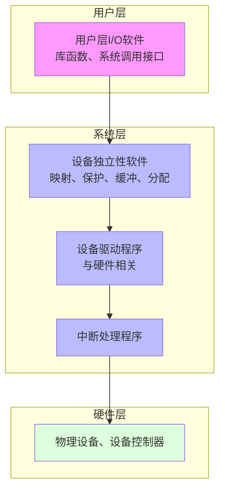
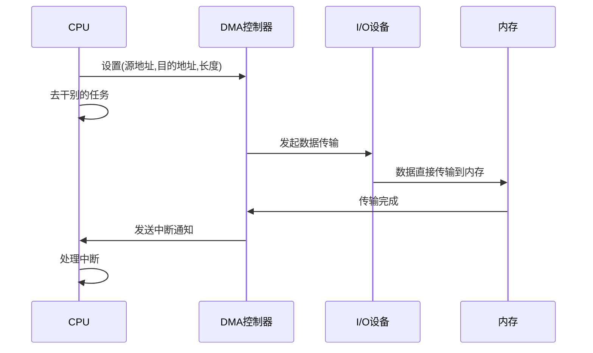
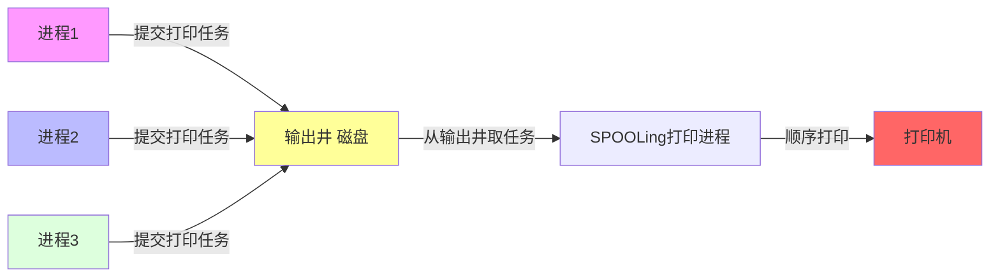

# 第7章 输入输出系统

## 7.1 I/O系统概述 ⭐

### 设备分类

| 分类标准 | 类别 | 例子 |
|----------|------|------|
| **传输速率** | 低速 / 中速 / 高速 | 键盘 / 打印机 / 磁盘 |
| **信息交换单位** | 块设备 / 字符设备 | 磁盘 / 键盘 |
| **共享属性** | 独占 / 共享 / 虚拟 | 打印机 / 磁盘 / SPOOLing后的打印机 |

| | 块设备 | 字符设备 |
|------|--------|----------|
| **单位** | 数据块 | 字符流 |
| **访问** | 随机访问 | 顺序访问 |
| **例子** | 磁盘、U盘 | 键盘、打印机 |

### I/O软件的层次结构




## 7.2 I/O控制方式 ⭐⭐⭐

| 方式 | CPU参与度 | 传输单位 | 特点 |
|------|-----------|----------|------|
| **程序直接控制** | 全程参与（轮询） | 字 | CPU利用率最低 |
| **中断驱动** | 发起+处理中断 | 字 | 多字需多次中断 |
| **DMA** | 开始+结束 | **块** | 批量传输，CPU利用率高 |
| **通道** | 几乎不参与 | 块 | 专用I/O处理器 |

### 1. 程序直接控制（轮询）
CPU循环检查设备状态寄存器，设备忙则等待。CPU利用率极低。

### 2. 中断驱动
CPU发起I/O后去干别的，设备完成后发中断通知CPU。
> 多字I/O需要多次中断 → 开销仍大

### 3. DMA方式 ⭐⭐

| 特点 | 说明 |
|------|------|
| 传输单位 | **块**（不是字） |
| 数据传输 | 设备↔内存，不经过CPU |
| 中断时机 | 整个块传输完成后才中断 |
| 需要 | DMA控制器 |

**DMA流程**：



### 4. 通道
专用处理器，执行通道程序，CPU基本不管。

| 通道类型 | 连接设备 | 特点 |
|----------|----------|------|
| **字节多路通道** | 多个低速设备 | 分时传输 |
| **选择通道** | 一个高速设备 | 独占传输 |
| **数组多路通道** | 多个高速设备 | 交叉传输 |

## 7.3 中断处理

### 中断类型

| 类型 | 来源 | 同步/异步 |
|------|------|-----------|
| **内中断（异常）** | CPU内部 | 同步 |
| **外中断（中断）** | CPU外部 | 异步 |

### 中断处理流程
1. 保存现场（PSW、PC入栈）
2. 分析中断源
3. 执行中断处理程序
4. 恢复现场

> 中断处理程序要求：执行时间短、不能被阻塞、不能调用可能阻塞的函数。

## 7.4 设备驱动程序

设备驱动程序是直接与设备控制器交互的软件，每个设备类型对应一个驱动。

**功能**：初始化设备、收发I/O请求、处理中断、设备电源管理。

> 设备驱动程序与硬件密切相关，在内核态运行。

## 7.5 设备独立性软件

设备独立性软件是位于设备驱动程序之上的软件层，提供设备无关的操作。

**主要功能**：
- 提供统一I/O接口
- 设备保护与命名映射
- 缓冲管理
- 设备分配与回收
- 差错处理

### 设备分配数据结构

| 表 | 含义 |
|----|------|
| **DCT** | 设备控制表（每设备一张） |
| **COCT** | 控制器控制表 |
| **CHCT** | 通道控制表 |
| **SDT** | 系统设备表（全局一张） |

### 设备分配策略

| 策略 | 说明 |
|------|------|
| **静态分配** | 进程运行前一次分配，运行完释放 |
| **动态分配** | 运行时按需分配 |

## 7.6 SPOOLing技术（假脱机）⭐⭐

**SPOOLing**：把独占设备变成共享设备的虚拟设备技术。

### 组成

| 组件 | 作用 |
|------|------|
| **输入井** | 磁盘区域，暂存输入数据 |
| **输出井** | 磁盘区域，暂存输出数据 |
| **输入进程** | 模拟输入设备 |
| **输出进程** | 模拟输出设备 |

### 例子：假脱机打印



> [!tip] 效果：逻辑上每个进程都有"自己的打印机"

## 7.7 缓冲管理 ⭐⭐

### 缓冲的作用
1. 缓和CPU与I/O设备速度不匹配
2. 减少对CPU的中断频率
3. 解决数据粒度不匹配

### 缓冲区类型

| 类型 | 说明 |
|------|------|
| **单缓冲** | 一个缓冲区，处理时间 T = max(C, T) + M |
| **双缓冲** | 两个缓冲区交替使用，提高并行度 |
| **循环缓冲** | 多个缓冲区组成环形 |
| **缓冲池** | 系统公共缓冲区集合，供所有进程共享 |

## 7.7 缓冲管理
### 7.7.1 缓冲的引入
**缓冲**是指在内存中设置的临时存储区域，用于协调设备和CPU之间的速度差异。

**目的**：
- 提高I/O效率
- 减少CPU的等待时间
- 协调设备之间的速度差异

### 7.7.2 单缓冲和双缓冲
**单缓冲**：只使用一个缓冲区。

**双缓冲**：使用两个缓冲区，一个用于输入，一个用于输出。

**优点**：
- 双缓冲比单缓冲的效率更高
- 可以实现设备和CPU的并行操作

### 7.7.3 环形缓冲区
**环形缓冲区**是一种循环使用的缓冲区，用于处理数据流。

**特点**：
- 缓冲区大小固定
- 指针循环移动
- 适用于连续的数据传输

### 7.7.4 缓冲池
**缓冲池**是由多个缓冲区组成的池，用于管理缓冲区的分配和回收。

**组成**：
- 空缓冲区队列
- 输入缓冲区队列
- 输出缓冲区队列

**优点**：
- 提高缓冲区的利用率
- 减少缓冲区的分配和回收开销

## 7.8 磁盘调度算法 ⭐⭐⭐

### 磁盘访问时间

```
总访问时间 = 寻道时间 + 旋转延迟 + 传输时间
```

| 时间 | 含义 | 占比 |
|------|------|------|
| **寻道时间** | 磁头移动到目标磁道 | **最大头** |
| **旋转延迟** | 扇区旋转到磁头下 | 中间 |
| **传输时间** | 读写数据 | 最短 |

> [!tip] 平均旋转延迟 = 转一圈时间/2
> 7200rpm：转一圈 ≈ 8.3ms，平均旋转延迟 ≈ 4.17ms

### 调度算法对比

| 算法 | 策略 | 优点 | 缺点 |
|------|------|------|------|
| **FCFS** | 按请求顺序 | 公平 | 效率最低 |
| **SSTF** | 选最近请求 | 平均寻道短 | 可能**饥饿** |
| **SCAN（电梯）** | 单向到端再折返 | 避免饥饿 | 两端等待不均 |
| **C-SCAN** | 单向到头直接回起点 | 各位置等待时间均匀 | 返回不服务 |
| **LOOK** | SCAN改进，到最远请求回头 | 减少不必要移动 | — |
| **C-LOOK** | C-SCAN改进，到最远请求回头 | 结合两者优点 | — |

### 计算题示例

> 磁道请求：98, 183, 37, 122, 14, 124, 65, 67，当前在53，向0号方向

**SSTF**：
```
53 → 65(12) → 67(2) → 37(30) → 14(23) → 98(84) → 122(24) → 124(2) → 183(59)
寻道长度 = 12+2+30+23+84+24+2+59 = 236
```

**SCAN（向0方向）**：
```
53 → 37 → 14 → 0 → 65 → 67 → 98 → 122 → 124 → 183
寻道长度 = (53-0) + (183-0) = 236
```

## 7.9 本章小结
- I/O四层体系：用户层 / 设备独立性软件 / 驱动程序 / 中断处理程序
- I/O控制方式：程序直接控制 → 中断 → DMA → 通道（CPU参与递减）
- SPOOLing：把独占设备虚拟成共享设备
- 缓冲：单/双/循环/缓冲池，缓解速度不匹配
- 磁盘调度：FCFS / SSTF / SCAN / C-SCAN / LOOK / C-LOOK

## 习题7（含考研真题）

---

[[第6章-虚拟存储器.md|← 上一章]] | [[操作系统目录.md|返回目录]] | [[第8章-文件管理.md|下一章 →]]