# 408计算机学科专业基础

本仓库包含考研计算机学科专业基础综合的四大科目知识图谱。

## 文件夹结构

```
408/
├── 408考研知识图谱.md     ← 知识图谱入口
├── 408考研真题汇总.md      ← 真题库
├── 01-数据结构/           ← 数据结构（7章）
├── 02-计算机组成原理/     ← 计算机组成原理（7章）
├── 03-计算机网络/         ← 计算机网络（7章）
└── 04-操作系统/          ← 操作系统（11章）
```

## 知识体系总览

```mermaid
graph TD
    DS[数据结构] --> Linear[线性表]
    DS --> Stack[栈和队列]
    DS --> Tree[树和二叉树]
    DS --> Graph[图]
    DS --> Search[查找]
    DS --> Sort[排序]
    DS --> Algorithm[算法分析]
    
    OS[操作系统] --> Intro[操作系统概述]
    OS --> Process[进程描述与控制]
    OS --> Schedule[处理机调度]
    OS --> Sync[进程同步与死锁]
    OS --> Memory[存储器管理]
    OS --> Virtual[虚拟存储器]
    OS --> File[文件管理]
    OS --> IO[输入输出系统]
    
    CO[计算机组成原理] --> Overview[计算机系统概述]
    CO --> Data[数据的表示和运算]
    CO --> Storage[存储器层次结构]
    CO --> Instruction[指令系统]
    CO --> Bus[总线系统]
    CO --> CPU[中央处理器]
    CO --> IO[输入输出系统]
    
    CN[计算机网络] --> Intro[计算机网络概述]
    CN --> Physical[物理层]
    CN --> Datalink[数据链路层]
    CN --> Network[网络层]
    CN --> Transport[传输层]
    CN --> Application[应用层]
    CN --> Security[网络安全]
```



## 四门学科的关系

- [[02-计算机组成原理/计算机组成原理目录]]：计算机硬件基础，是其他学科的底层支撑
- [[03-操作系统/操作系统目录]]：管理计算机硬件资源，提供服务给上层软件
- [[01-数据结构/数据结构目录]]：数据的组织方式和算法设计
- [[04-计算机网络/计算机网络目录]]：计算机之间的通信和资源共享

## 快速入口

### 数据结构
- [[01-数据结构/第1章-线性表|线性表]]：基础数据结构，是栈、队列、树、图的基础
- [[01-数据结构/第2章-栈和队列|栈和队列]]：特殊线性表，应用广泛
- [[01-数据结构/第3章-树和二叉树|树和二叉树]]：非线性结构，重要考点
- [[01-数据结构/第4章-图|图]]：复杂非线性结构
- [[01-数据结构/第5章-查找|查找]]：数据检索技术
- [[01-数据结构/第6章-排序|排序]]：数据组织技术
- [[01-数据结构/第7章-算法分析|算法分析]]：算法复杂度分析

### 计算机组成原理
- [[02-计算机组成原理/第1章-计算机系统概述|计算机系统概述]]：整体认识
- [[02-计算机组成原理/第2章-数据的表示和运算|数据的表示和运算]]：数据在计算机中的表示
- [[02-计算机组成原理/第3章-存储器层次结构|存储器层次结构]]：存储系统
- [[02-计算机组成原理/第4章-指令系统|指令系统]]：计算机指令
- [[02-计算机组成原理/第5章-中央处理器|CPU]]：处理器结构
- [[02-计算机组成原理/第6章-总线系统|总线]]：数据传输
- [[02-计算机组成原理/第7章-输入输出系统|输入输出系统]]：I/O系统

### 操作系统
- [[03-操作系统/第1章-操作系统概述|操作系统概述]]：操作系统概念
- [[03-操作系统/第2章-进程的描述与控制|进程管理]]：进程与线程
- [[03-操作系统/第3章-处理机调度|CPU调度]]：处理机调度算法
- [[03-操作系统/第4章-进程同步与死锁|进程同步]]：同步与互斥
- [[03-操作系统/第5章-存储器管理|内存管理]]：内存分配
- [[03-操作系统/第6章-虚拟存储器|虚拟内存]]：虚拟存储技术
- [[03-操作系统/第7章-输入输出系统|输入输出系统]]：I/O系统
- [[03-操作系统/第8章-文件管理|文件管理]]：文件系统
- [[03-操作系统/第9章-磁盘存储器管理|磁盘存储器管理]]：磁盘管理
- [[03-操作系统/第10章-多处理机操作系统|多处理机操作系统]]：多核系统
- [[03-操作系统/第11章-虚拟化和云计算|虚拟化和云计算]]：虚拟化技术

### 计算机网络
- [[04-计算机网络/第1章-计算机网络概述|网络概述]]：网络基础
- [[04-计算机网络/第2章-物理层|物理层]]：物理传输
- [[04-计算机网络/第3章-数据链路层|数据链路层]]：链路控制
- [[04-计算机网络/第4章-网络层|网络层]]：IP协议
- [[04-计算机网络/第5章-传输层|传输层]]：TCP/UDP
- [[04-计算机网络/第6章-应用层|应用层]]：网络应用
- [[04-计算机网络/第7章-网络安全|网络安全]]：网络安全

## 学科间关联

### 计算机组成原理 ↔ 操作系统
- [[02-计算机组成原理/第3章-存储器层次结构]] ↔ [[03-操作系统/第5章-存储器管理]]：内存管理原理
- [[02-计算机组成原理/第3章-存储器层次结构]] ↔ [[03-操作系统/第6章-虚拟存储器]]：虚拟内存
- [[02-计算机组成原理/第5章-中央处理器]] ↔ [[03-操作系统/第3章-处理机调度]]：CPU调度
- [[02-计算机组成原理/第6章-总线系统]] ↔ [[03-操作系统/第7章-输入输出系统]]：I/O系统

### 数据结构 ↔ 操作系统
- [[01-数据结构/第1章-线性表]] ↔ [[03-操作系统/第2章-进程的描述与控制]]：进程控制块
- [[01-数据结构/第2章-栈和队列]] ↔ [[03-操作系统/第3章-处理机调度]]：调度队列
- [[01-数据结构/第3章-树和二叉树]] ↔ [[03-操作系统/第4章-进程同步与死锁]]：进程树
- [[01-数据结构/第5章-查找]] ↔ [[03-操作系统/第6章-虚拟存储器]]：页表查找

### 计算机组成原理 ↔ 数据结构
- [[02-计算机组成原理/第2章-数据的表示和运算]] ↔ [[01-数据结构/第5章-查找]]：查找算法效率
- [[02-计算机组成原理/第3章-存储器层次结构]] ↔ [[01-数据结构/第7章-算法分析]]：时间复杂度

### 计算机网络 ↔ 操作系统
- [[04-计算机网络/第4章-网络层]] ↔ [[03-操作系统/第4章-进程同步与死锁]]：网络死锁
- [[04-计算机网络/第5章-传输层]] ↔ [[03-操作系统/第2章-进程的描述与控制]]：端口与进程

## 考研重点提示

### 数据结构（必考）
- 线性表：顺序表与链表对比
- 栈和队列：表达式求值、层次遍历
- 树和二叉树：遍历算法、平衡二叉树
- 图：遍历、最短路径、拓扑排序
- 查找：哈希表、二叉排序树
- 排序：快速排序、归并排序

### 计算机组成原理（必考）
- 数据的表示：原码、反码、补码
- 运算方式：定点运算、浮点运算
- 存储层次：Cache、虚拟存储器
- 指令系统：指令格式、寻址方式
- CPU：数据通路、流水线

### 操作系统（必考）
- 进程管理：状态转换、调度算法
- 进程同步：信号量、临界区
- 死锁：银行家算法
- 内存管理：分配算法、页面置换
- 虚拟内存：分页、分段

### 计算机网络（必考）
- 物理层：编码、传输介质
- 数据链路层：帧、差错控制
- 网络层：IP、路由
- 传输层：TCP、UDP
- 应用层：HTTP、DNS
